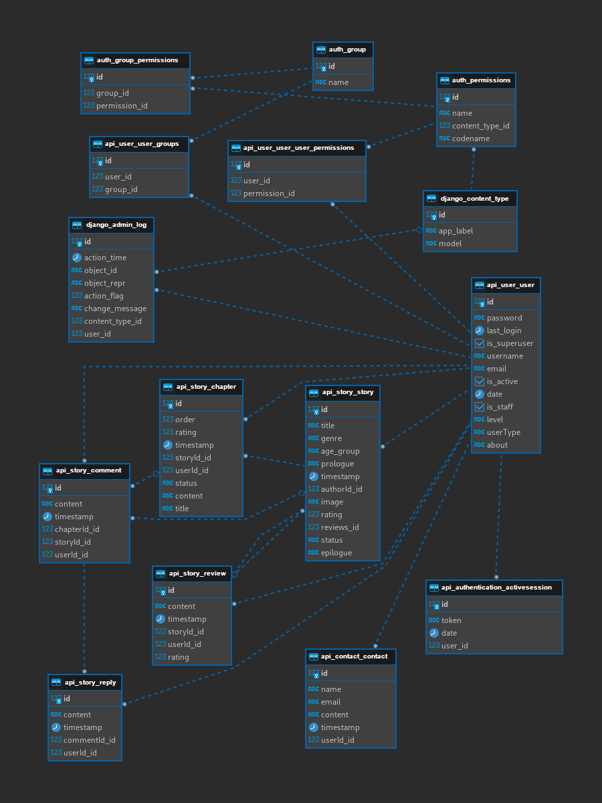

<div align="center">

  
  <h1>SpaceThreads</h1>
  
  <p>
    Unveiling the Universe, One Story at a Time.
  </p>


<h4>
    <a href="https://st.ihaji.pro/">Visit Website</a>
  <span> · </span>
    <a href="https://trello.com/b/RFAVvXwQ/spacethreads/">Trello Board</a>
  <span> · </span>
    <a href="https://git.generalassemb.ly/astronauts-team/space-threads/issues/">Report Bugs</a>
  </h4>
</div>

<br />


<!-- Table of Contents -->
# :notebook_with_decorative_cover: Table of Contents

- [About the Project](#star2-about-the-project)
  * [Data Modeling](#star2-data-modeling)
  * [User Stories](#star2-user-stories)
  * [Tech Stack](#star2-tech-stack)
  * [Features](#star2-features)
- [Getting Started](#star2-getting-started)
  * [Prerequisites](#star2-prerequisites)
  * [Environment Variables](#star2-environment-variables)
  * [Installation](#star2-installation)
  * [Run Locally](#star2-run-locally)
  * [Deployment](#star2-deployment)
- [Usage](#star2-usage)
- [Roadmap](#star2-roadmap)
- [Contributing](#star2-contributing)
- [FAQ](#star2-faq)
- [License](#star2-license)
- [Contact](#star2-contact)
- [Acknowledgements](#star2-acknowledgements)


<!-- About the Project -->
## :star2: About the Project

<div align="center"> 
  
</div>

<br />

<p>
Welcome to the universe of creativity and collaboration – SpaceThreads! Conceived by a talented team comprising Ali Haji (as a spaceship captain) along with Ahmed Almadhoob, Hamad Alhibshi, and Qasim Alkuwaiti for their final capstone at General Assembly, it is a web application that reimagines storytelling.

Inspired by the boundless expanse of infinite space and the concept of parallel universes, SpaceThreads is a dynamic platform that empowers individuals to craft their own unique stories. With the robust Django backend and the engaging React frontend, this project brings together the best of web development.

At SpaceThreads, the traditional boundaries between authors and readers dissolve, creating an interactive space where stories come to life through collaboration. Whether you're a seasoned writer or a newcomer, SpaceThreads offers an innovative stage for your literary aspirations.

Join us in this cosmic journey, where storytelling has no limits. Explore SpaceThreads and dive into a universe where creativity knows no bounds – your literary adventure awaits!
</p>

 - [Collaborative Writing](https://en.wikipedia.org/wiki/Collaborative_writing)
 - [Networked Books](https://en.wikipedia.org/wiki/Networked_book)


<!-- Data Modeling -->
### :star2: Data Modeling

<p>Here you can find the Entity Relationship Diagram (ERD):</p>

<div align="center"> 
  
</div>


<!-- User Stories -->
### :star2: User Stories

<p>We have asked six types of users what features and why they want to use the application, and the survey results were as the following:</p>

<ul>
  <li>As an Aspiring Writer: I want to write and publish stories: To share my creativity with the community.</li>
  <li>As a Participating Writer: I want to collaborate with others: To co-author stories and learn from fellows.</li>
  <li>As a Learning Writer: I want to receive reviews and comments: To improve my skills and connect with readers.</li>
  <li>As a Reader and Enthusiast: I want to browse a diverse library of stories: So I can discover new authors.</li>
  <li>As a Critical Reader: I want to leave comments and feedback: To engage with authors and fellow readers.</li>
  <li>As an Administrator: I want to manage user accounts: To ensure a safe and enjoyable platform experience.</li>
</ul>


<!-- TechStack -->
### :star2: Tech Stack

<details>
  <summary>Frontend</summary>
  <ul>
    <li><a href="https://developer.mozilla.org/en-US/docs/Web/">HTML, CSS, JavaScript</a></li>
    <li><a href="https://react.dev/">React Frontend Framework</a></li>
    <li><a href="https://mui.com/material-ui/">Material UI Component Library</a></li>
    <li><a href="https://emotion.sh/docs/introduction">Emotion.js Styling Library</a></li>
    <li><a href="https://github.com/gka/chroma.js/">Chroma.js Color Library</a></li>
    <li><a href="https://web.dev/vitals/">Web Vitals Metrics</a></li>
    <li><a href="https://axios-http.com/">Axios HTTP Client</a></li>
  </ul>
</details>

<details>
  <summary>Backend</summary>
  <ul>
    <li><a href="https://www.python.org/">Python Programming Language</a></li>
    <li><a href="https://www.djangoproject.com/">Django Backend Framework</a></li>
    <li><a href="https://www.django-rest-framework.org/">Django REST Framework</a></li>
    <li><a href="https://github.com/adamchainz/django-cors-headers/">Django CORS Headers</a></li>
    <li><a href="https://github.com/jpadilla/pyjwt/">Python JWT Implementation</a></li>
    <li><a href="https://cloudinary.com/">Cloudinary Image API</a></li>
    <li><a href="https://gunicorn.org/">Gunicorn WSGI HTTP Server</a></li>
  </ul>
</details>

<details>
<summary>DevOps, Databases, etc.</summary>
  <ul>
    <li><a href="https://www.github.com/">GitHub Enterprise CI/CD</a></li>
    <li><a href="https://render.com/">Render Cloud Hosting</a></li>
    <li><a href="https://www.docker.com/">Docker Containerization</a></li>
    <li><a href="https://nginx.org/en/">Nginx Web Server</a></li>
    <li><a href="https://www.postgresql.org/">PostgreSQL Database</a></li>
    <li><a href="https://neon.tech/">Neon Database PaaS</a></li>
  </ul>
</details>


<!-- Getting Started -->
## 	:star2: Getting Started


<!-- Prerequisites -->
### :star2: Prerequisites

This project uses NPM as package manager:

```bash
 npm install --global npm
```

<!-- Env Variables -->
### :star2: Environment Variables

To run this project, you will need to add the following environment variables to your '.env' file: `SECRET_KEY`, `DJANGO_ALLOWED_HOSTS`, `DB_ENGINE`, `DB_DATABASE`, `DB_USER`, `DB_PASSWORD`, `DB_HOST`, `DB_PORT`.


<!-- Installation -->
### :star2: Installation

Install it with NPM as the following:

```bash
  npm install
  cd space-threads
```


<!-- Run Locally -->
### :star2: Run Locally

Clone the project

```bash
  git clone git://git.generalassemb.ly/astronauts-team/space-threads.git
```

Go to the project directory

```bash
  cd space-threads
```

Install dependencies

```bash
  npm install
```

Start the server

```bash
  npm run start
```


<!-- Deployment -->
### :star2: Deployment

To deploy this project run:

```bash
  npm deploy
```


<!-- Roadmap -->
## :star2: Roadmap

* [ ] Frontend Dashboard
* [ ] Deployment CI/CD


<!-- Contributing -->
## :star2: Contributing

Contributions are always welcome. [Click here](https://git.generalassemb.ly/astronauts-team/space-threads/issues/) to request a feature or report a bug.


<!-- License -->
## :warning: License

Distributed under the MIT License. [Click here](LICENSE.md) for more information.


<!-- Acknowledgments -->
## :gem: Acknowledgements

We would like to thank Tor Johnson, Avan Sardar, Ahlam Almutawa and Rawan Alqassab.
